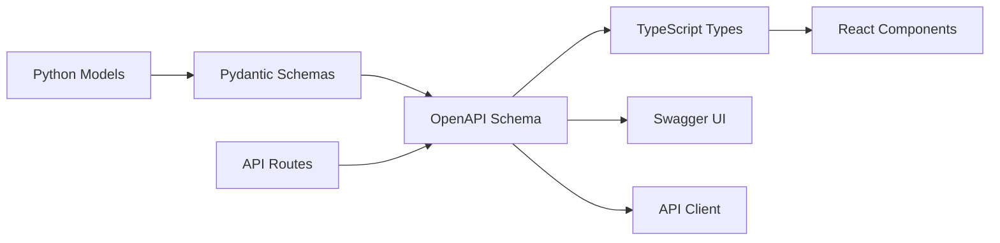

# 🚀 Codifeed

**A modern, type-safe social network built for developers**

[](#tech-stack)
[](#type-safety)
[](LICENSE)
[](https://cs50.harvard.edu/x/)

---

## 🎯 About

Codifeed is an **open-source social network designed specifically for developers**. Built as the capstone project for Harvard's CS50x course, it demonstrates how to create a **production-ready, type-safe full-stack application** using React, TypeScript and Flask (Python).

This project showcases **complete type safety** between a Python backend and TypeScript frontend through OpenAPI specifications, advanced security patterns, and professional-grade architecture suitable for scaling.

### 🎯 Project Goals

- **CS50x Validation**: Demonstrate mastery of full-stack development concepts
- **Type Safety**: Achieve 100% type safety between Python backend and TypeScript frontend
- **Best Practices**: Showcase modern web development patterns and security practices
- **Open Source**: Provide a reference implementation for the community

---

## ✨ Product Features

### 🔐 Authentication & Security

- **JWT Authentication** - Secure registration and login system
- **Password Security** - Argon2 password hashing and validation
- **OAuth Integration** - Optional GitHub and Google authentication
- **Session Management** - Automatic token refresh and secure logout

### 👤 Developer Profiles

- **Personal Profiles** - View your own and other developers' profiles
- **Profile Customization** - Upload profile pictures, write bios, and showcase skills
- **Tech Stack Badges** - Display expertise with technology tags (React, Python, etc.)
- **Developer Identity** - Clean, professional profile layout for the dev community

### 📝 Posts & Content Creation

- **Rich Text Posts** - Create and edit posts with full Markdown support
- **Code Snippets** - Share code with syntax highlighting and copy-to-clipboard functionality
- **Image Uploads** - Attach images to posts for tutorials and showcases
- **Post Management** - Edit and delete your own posts with version control

### 💫 Social Interactions

- **Engagement System** - Like, comment, and repost functionality
- **Follow Network** - Follow/unfollow other developers to build your network
- **Interaction Counts** - Display likes, comments, and repost metrics
- **Community Building** - Foster connections within the developer community

### 🌐 Feed & Discovery

- **Dual Feed System** - Switch between "Explore" (global) and "Following" (curated) feeds
- **Smart Filtering** - Filter posts by technology tags or specific users
- **Search Functionality** - Find users and posts by keywords, tags, or content
- **Trending Content** - Discover popular posts and active developers

### 🔔 Notifications & Updates

- **Real-time Notifications** - Get notified of new followers, likes, and comments
- **Notification Center** - Dedicated page and dropdown for managing notifications
- **Activity Tracking** - Stay updated on community interactions and engagement

### 🎨 User Experience

- **Mobile-First Design** - Responsive layout optimized for all devices
- **Developer-Focused UI** - Clean, minimal interface designed for developers
- **Performance Optimized** - Fast loading with modern React patterns
- **Accessibility** - WCAG compliant design for inclusive user experience

### ⚙️ Admin Tools _(Optional)_

- **Content Moderation** - Tools for managing reported content and community standards
- **Usage Analytics** - Insights into user engagement and platform growth
- **User Management** - Administrative controls for user accounts and permissions

---

## 🏗️ Infrastructure Features

### 🔒 Enterprise-Grade Security

- **JWT Authentication** - Secure cookie-based authentication with auto-refresh
- **CSRF Protection** - Complete CSRF protection with double-submit cookie pattern
- **Rate Limiting** - API rate limiting to prevent abuse
- **Input Validation** - Comprehensive input validation using Pydantic models
- **SQL Injection Protection** - SQLModel ORM with parameterized queries

### 🎯 Complete Type Safety

- **OpenAPI Integration** - Automatic API documentation and client generation
- **Generated Types** - TypeScript types auto-generated from Python models
- **Runtime Validation** - Request/response validation at runtime
- **End-to-End Type Safety** - From database to UI components

### 🚀 Developer Experience

- **Hot Reload** - Instant development feedback with Vite and Flask dev server
- **Code Quality** - Automated linting, formatting, and type checking
- **Database Migrations** - Alembic migrations with version control
- **API Documentation** - Interactive Swagger UI for API exploration
- **Test Coverage** - Comprehensive test suite with coverage reporting

---

## 🛠️ Tech Stack

### Frontend

- **[React 19](https://react.dev/)** - Modern UI library with latest features
- **[TypeScript](https://www.typescriptlang.org/)** - Type-safe JavaScript development
- **[TanStack Router](https://tanstack.com/router)** - Type-safe routing with file-based routing
- **[TanStack Query](https://tanstack.com/query)** - Powerful data fetching and state management
- **[TailwindCSS](https://tailwindcss.com/)** - Utility-first CSS framework
- **[Shadcn/ui](https://ui.shadcn.com/)** - High-quality accessible components
- **[Zod](https://zod.dev/)** - TypeScript-first schema validation

### Backend

- **[Python 3.13](https://www.python.org/)** - Latest Python with performance improvements
- **[Flask-OpenAPI3](https://flask-openapi3.readthedocs.io/)** - Flask with automatic OpenAPI documentation
- **[SQLModel](https://sqlmodel.tiangolo.com/)** - Modern ORM with Pydantic integration
- **[Flask-JWT-Extended](https://flask-jwt-extended.readthedocs.io/)** - JWT authentication for Flask
- **[Alembic](https://alembic.sqlalchemy.org/)** - Database migration tool
- **[Argon2](https://argon2-cffi.readthedocs.io/)** - Secure password hashing

### Database & Storage

- **[PostgreSQL](https://www.postgresql.org/)** - Reliable relational database
- **[Neon](https://neon.tech/)** - Serverless PostgreSQL hosting
- **[Cloudflare R2](https://www.cloudflare.com/products/r2/)** - Object storage for media files

### Hosting & Deployment

- **[Vercel](https://vercel.com/)** - Frontend hosting with global CDN
- **[Railway](https://railway.app/)** - Backend API hosting with automatic deployments
- **[GitHub Actions](https://github.com/features/actions)** - CI/CD pipeline for testing and deployment

### Development Tools

- **[Ruff](https://docs.astral.sh/ruff/)** - Lightning-fast Python linter and formatter
- **[Pyright](https://github.com/microsoft/pyright)** - Static type checker for Python
- **[ESLint](https://eslint.org/)** - TypeScript/React linting
- **[Prettier](https://prettier.io/)** - Code formatting
- **[Poetry](https://python-poetry.org/)** - Python dependency management

---

## 🔗 Type Safety Architecture

One of the key features of Codifeed is **complete type safety** between the backend and frontend:



### How it works:

1. **Backend Models** - SQLModel defines database models with full type hints
2. **Pydantic Validation** - Automatic request/response validation
3. **OpenAPI Generation** - Flask-OpenAPI3 generates OpenAPI specification
4. **Type Generation** - `openapi-typescript` creates TypeScript types from OpenAPI
5. **Type-Safe Client** - `openapi-fetch` provides fully typed API calls
6. **Runtime Safety** - Zod schemas validate data at component boundaries

This ensures that any changes to the backend API are immediately reflected in the frontend types, catching errors at compile time rather than runtime.

---

## 🚀 Quick Start

### Prerequisites

- **Node.js 22+** and **pnpm 10+**
- **Python 3.13+** and **Poetry**
- **PostgreSQL** (or use Neon for cloud database)

### 1. Clone the repository

```bash
git clone https://github.com/yourusername/codifeed.git
cd codifeed
```

### 2. Backend Setup

```bash
cd api
poetry install
poetry run python dev.py
```

### 3. Frontend Setup

```bash
cd web
pnpm install
pnpm run openapi-ts  # Generate types from API
pnpm run dev
```

### 4. Database Setup

```bash
cd api
poetry run alembic upgrade head
```

The application will be available at:

- **Frontend**: http://localhost:3000
- **API**: http://localhost:8000
- **API Documentation**: http://localhost:8000/swagger

---

## 📁 Project Structure

```
codifeed/
├── api/                         # Flask REST API
│   ├── app/
│   │   ├── config.py            # Application configuration
│   │   ├── database/            # Database engine, session & initialization
│   │   ├── middlewares/         # Custom middleware (auto-refresh, exceptions)
│   │   ├── models/              # SQLModel database models by domain
│   │   ├── routes/              # API route handlers by domain
│   │   ├── services/            # Business logic layer
│   │   └── utils/               # Utility functions (hashing, JWT, logging)
│   │   └── __init__.py          # Flask app factory
│   │   └── config.py            # Configuration file
│   ├── migrations/              # Alembic database migrations
│   ├── dev.py                   # Development server entry point
│   ├── wsgi.py                  # Production WSGI entry point
│   ├── Dockerfile               # Container configuration
│   ├── pyproject.toml           # Python dependencies & project config
│   └── railway.json             # Railway deployment configuration
│
├── web/                         # React frontend
│   ├── src/
│   │   ├── assets/              # Static assets and images
│   │   ├── components/
│   │   │   ├── layout/          # Layout components (header, etc.)
│   │   │   └── ui/              # Reusable UI components (shadcn/ui)
│   │   ├── features/            # Feature-based modules with
│   │   │   └── [feature]/       # Feature directory
│   │   │       ├── api/         # Queries & mutations
│   │   │       ├── assets/      # Feature assets
│   │   │       ├── hooks/       # Custom hooks
│   │   │       └── services/    # Feature logic
│   │   ├── hooks/               # Global custom hooks
│   │   ├── routes/              # TanStack Router file-based routing
│   │   │   ├── _authenticated/  # Protected routes
│   │   │   └── _unauthenticated/# Public routes
│   │   ├── services/            # Global services (HTTP client, storage)
│   │   ├── styles/              # Global CSS styles
│   │   ├── types/
│   │   │   └── generated/       # Auto-generated API types from OpenAPI
│   │   └── utils/               # Utility functions
│   ├── package.json             # Node.js dependencies
│   ├── vite.config.js           # Vite bundler configuration
│   └── vercel.json              # Vercel deployment configuration
│
└── database/                    # Database scripts and docker setup
```

---

## 🌐 Deployment

### Production Environment

The application is designed for cloud-native deployment:

- **Frontend** → Vercel (Automatic deployments from `main` branch)
- **Backend** → Railway (Docker-based deployment)
- **Database** → Neon PostgreSQL (Serverless, auto-scaling)
- **Storage** → Cloudflare R2 (Global object storage)

### Environment Variables

Required environment variables for production:

```bash
# Backend (.env)
DATABASE_URL="postgresql://..."
JWT_SECRET_KEY="your-secret-key"
SECRET_KEY="your-flask-secret"
CORS_ORIGINS="https://yourapp.vercel.app"

# Frontend (.env.local)
VITE_API_URL="https://yourapi.railway.app"
```

---

## 🤝 Contributing

We welcome contributions! This project serves as a learning resource for developers interested in modern full-stack development.

### Development Workflow

1. Fork the repository
2. Create a feature branch: `git checkout -b feature/amazing-feature`
3. Make your changes with full type safety
4. Run tests: `pnpm test` (frontend) and `poetry run pytest` (backend)
5. Submit a pull request

### Code Standards

- **Type Safety**: All code must be fully typed
- **Testing**: New features require tests
- **Documentation**: Update docs for API changes
- **Security**: Follow OWASP security guidelines

---

## 📚 Learning Resources

This project demonstrates concepts from:

- **Harvard CS50x** - Computer Science fundamentals
- **Full-Stack Development** - End-to-end application development
- **Type Safety** - Advanced TypeScript and Python typing
- **API Design** - RESTful API design with OpenAPI
- **Security** - Web application security best practices
- **DevOps** - Modern deployment and CI/CD practices

---

## 📄 License

This project is licensed under the MIT License - see the [LICENSE](LICENSE) file for details.

---

## 🙏 Acknowledgments

- **Harvard CS50x** for providing excellent computer science education
- **Open Source Community** for the amazing tools and libraries
- **Developer Community** for inspiration and feedback

---

<div align="center">

**Built with ❤️ for the developer community**

[🌟 Star this project](../../stargazers) • [🐛 Report Bug](../../issues) • [💡 Request Feature](../../issues)

</div>
